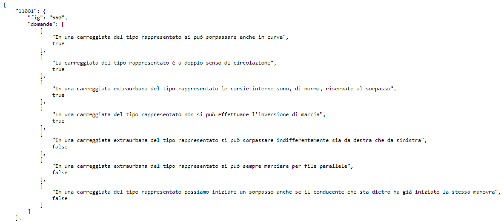

# Italian Driving School Quiz
## <span style="color:orange">License dataset based on Italian traffic laws</span>.
> This repository contains all the necessary quizzes you need in order to develop an application regarding the italian driving license. The dataset consist of __more than 7000 quizzes__ with the related __answer and image__ in case some question needs an explanatory picture. You can use this as a dataset for fetching quizzes in a quiz simulation application or any application related to the Italian driving license where there is a quiz section.

## <span style="color:orange">Repository structure</span>
> The repository is structured in a very simple and easy to understand way. Under __"fig"__ folder are located all the __images__ related to some questions in __jpg__ format.

> The __data.json__ file is the __main entity__ containing __all the questions and the related answers__ and also a reference to the __image__ contained in the __fig folder__ in case a question needs an explanatory image

## <span style="color:orange">Structure of the JSON file</span>
> The JSON file containing questions, answers and image reference as the following structure:

```json
{

        "<question group ID>":{
        "fig": "<number of the image in the fig folder>",
        "questions": [
            [
                "<Question 1>",
                "<answer true/false>"
            ],
            [
                "<Question 2>",
                "<answer true/false>"
            ],
            [
                "<Question 3>",
                "<answer true/false>"
            ],
            [
                "<Question 4>",
                "<answer true/false>"
            ],
            [
                "<Question 5>",
                "<answer true/false>"
            ],
            [
                "<Question 6>",
                "<answer true/false>"
            ],
            [
                "<Question 7>",
                "<answer true/false>"
            ],
            [
                "<Question N>",
                "<answer true/false>"
            ]
        ]
    },
    
}
```
## <span style="color:orange">Example extracted from the JSON file</span>



---
### __If you have any question or doubt please reach us!__
### __Authors__

* [__Alessandro Cavallotti__](https://www.instagram.com/scavalleroo/)
* [__Taqasar Walayat__](https://www.instagram.com/taqasar/)

---

<span style="color:orange">__*Please let us know if you use, copy, duplicate, replicate or distribute partially or entirely code sources, images or any file or folder related to this repository*__</span>
